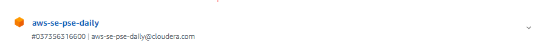
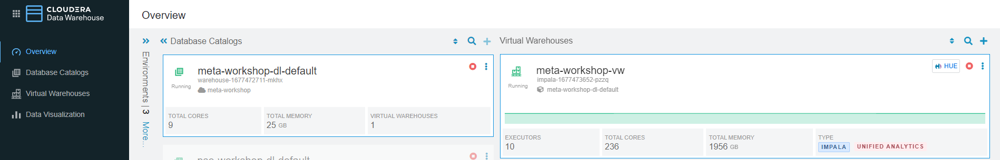
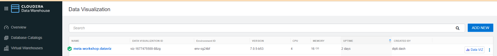
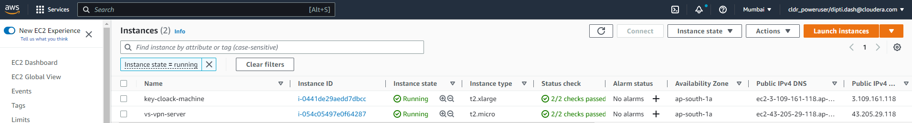
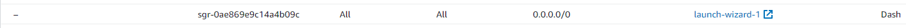
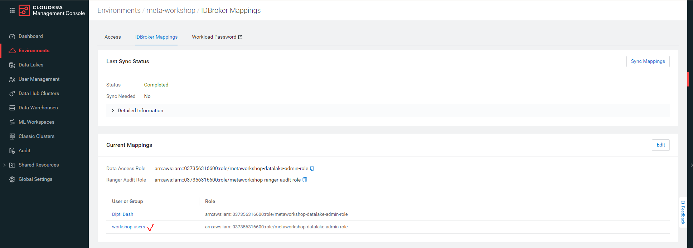
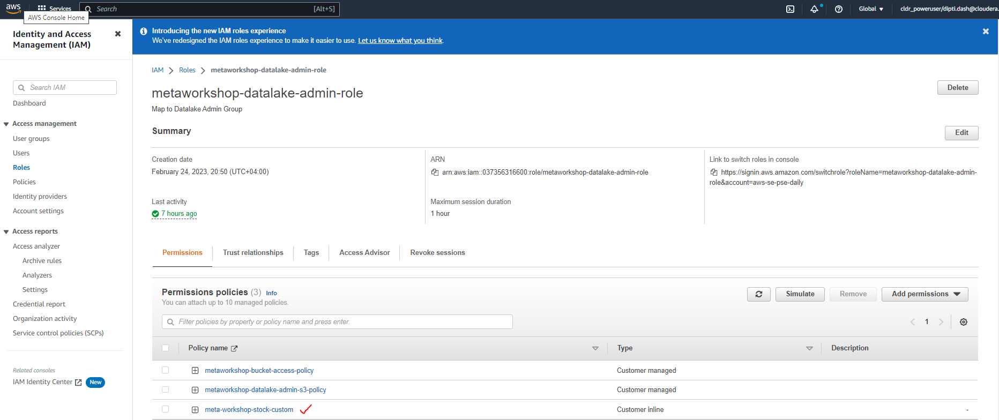
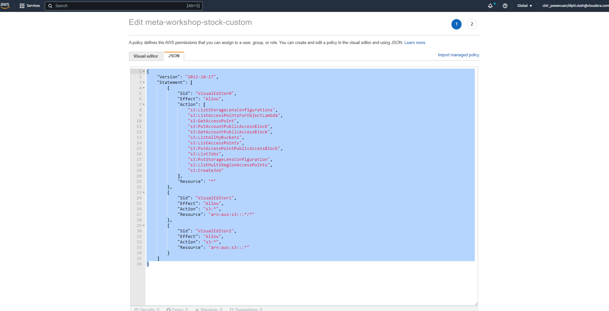
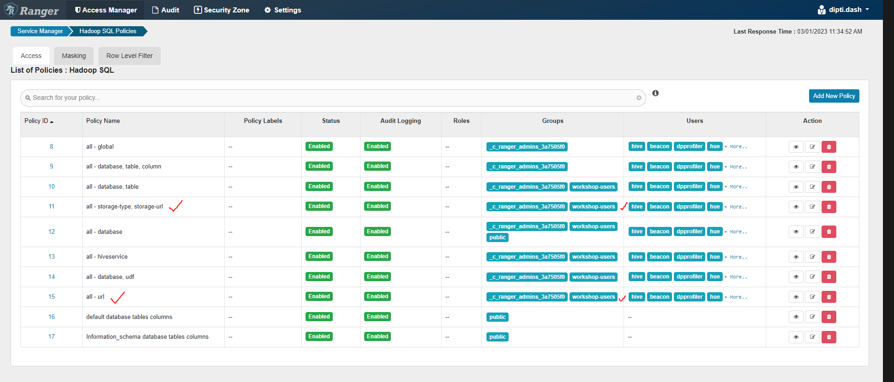
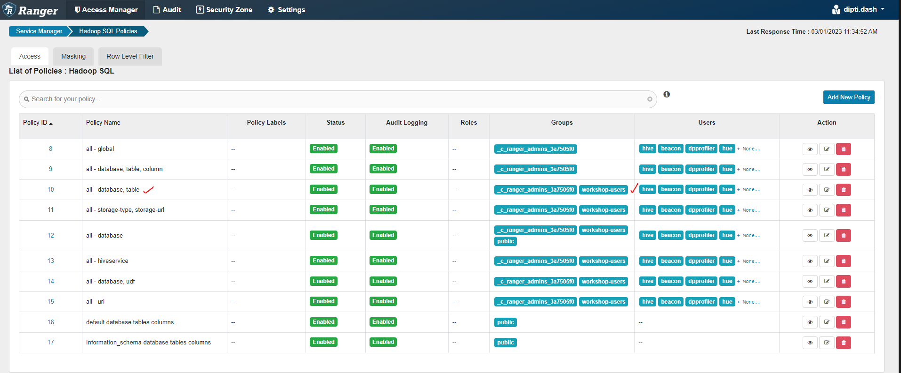

= Workshop Admin Guide

'''

Version : 1.0.0 `1st March 2023` +

'''
== Introduction

This document gives inputs on what is needed from the environment set up perspective to run this workshop.
. CDP environment (Running on AWS) - Depending on the number of users one might want to set it up in HA or Non-HA mode. This workshop has been tested on `meta-workshop` as part of `CDP Partner Workshop` okta tile. The underlying environment is making use of `aws-se-pse-daily`. 

  +
  +

You can set up the environment by following the guide here - 
https://docs.cloudera.com/cdp-public-cloud/cloud/aws-quickstart/topics/mc-aws-quickstart.html#mc-aws-quickstart[Setting Up CDP Environment using AWS] +

. CDW (Impala) - This is needed to run queries to test the iceberg features. 
  +

. CDF - This is needed to initiate a Nifi flow to collect stock data from AlphaVantage.

. CDE (Spark 3.2.0) - CDE is needed for CRUD statements to function.

. Data Viz - This is needed to build a small dashboard with the underlying stock data.
  +

. Key Cloak - The keycloak is running in the Mumbai region. 
  +
Make sure that the users can login to it using the http://3.109.161.118/auth/realms/workshop/protocol/saml/clients/samlclient[KeyCloak] url. +

So, either the security settings are set to 0.0.0.0/0 or individual IPs of workshop users.
  +

== Important Pointers

The purpose of this section is to capture the inputs that as an admin that you must be aware of while setting up the workshop and running the same.

=== 1. IDBroker Mapping
*Step*: Make sure that the ID broker mapping is done appropriately as shown below. +
  +

=== 2. CDF Flow failing
*Issue*: The CDF Nifi flow fails at the last step. +
*Solution*: There is a permission that needs to be added in AWS whose screenshot is added below. The additional permission is shown in the screenshot - `meta-workshop-stock-custom`. +
  +
  +
The .json file is uploaded in the admin folder. 

=== 3. CDE job failing 
*Issue*: The CDE job was failing. +
*Solution*: The permission issue was causing this issue and hence needed to add the ranger policies. +
  +

=== 4. Impala table is not visible (Hue/Data Viz)
*Issue*: The Impala tables are not visible in Hue and in Data Viz when the user logs in with their usernames like `wuser00`. +
*Solution*: Ranger permission needs to be appropriately set for `workshop-users` which is a group for users participating in the workshop. These users are part of the `workshop-users`. +
  +